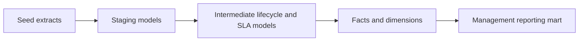

# Analytics Engineering Service Mart

## Project purpose

This repository is a local dbt analytics engineering project that turns fragmented service and operations extracts into clean, tested reporting models.

The implementation is local and reproducible. It uses synthetic seed data, SQL transformations, dbt tests, and documentation to show how raw operational records can become a maintainable service performance mart.

## Business problem

Service and operations reporting often starts with disconnected exports: case lists, team reference files, service events, status changes, categories, targets, and SLA extracts. The reporting layer becomes difficult to trust when transformations are hidden in spreadsheets or repeated manually.

The commercial scenario is a service function that cannot reliably answer basic management questions:

- how many cases are open;
- how many cases are overdue;
- how long cases take to close;
- which teams are under pressure;
- whether SLA performance is improving;
- which categories create the highest workload.

This project shows how those questions can be supported by a clear modelling route rather than one-off spreadsheet calculations.

## What this project demonstrates

- SQL transformation from raw extracts to reporting-ready models.
- dbt project structure with staging, intermediate, and mart layers.
- Dimensional modelling for service performance reporting.
- Defined model grain and metric logic.
- Data tests for keys, relationships, accepted values, and metric assumptions.
- Lineage from source extracts to management-facing outputs.
- Documentation that separates business questions from implementation detail.

## Architecture

Implemented dbt route:



The project keeps transformation logic in dbt rather than in a reporting tool. Staging models standardise the seed extracts, intermediate models calculate case lifecycle and SLA state, and mart models expose dimensions, facts, and a management-facing aggregate.

## Source tables

The project uses synthetic dbt seed files:

| Source seed | Purpose | Grain |
| --- | --- | --- |
| `raw_cases.csv` | One row per service case or operational request | Case |
| `raw_teams.csv` | Team reference data and reporting ownership | Team |
| `raw_service_events.csv` | Event history for assignment, status change, review, pause, and closure | Case event |
| `raw_case_categories.csv` | Case category and service grouping reference | Category |
| `raw_targets.csv` | SLA target thresholds by category and priority | Category/priority target |

## Facts and dimensions

| Model | Type | Grain | Purpose |
| --- | --- | --- | --- |
| `dim_team` | Dimension | One row per team | Team ownership, reporting unit, active flag |
| `dim_service_category` | Dimension | One row per category | Category grouping and reporting labels |
| `fact_case_performance` | Fact | One row per case | Case lifecycle, status, owner, SLA, overdue and cycle-time fields |
| `fact_service_event` | Fact | One row per case event | Event-level audit trail for lifecycle reconstruction |
| `mart_service_performance` | Mart | One row per reporting period, team, and category | Management-facing service metrics |

## Model grain

The main fact table uses one row per case. Event history remains separate so lifecycle calculations are traceable. The management mart aggregates to reporting period, team, and category.

## Data and sample-data provenance

All sample data is synthetic and non-client. It represents generic service activity only, such as cases, teams, service events, dates, statuses, categories, and simple SLA indicators.

See [docs/data-dictionary.md](docs/data-dictionary.md) for field definitions, row counts, assumptions, and known data imperfections.

## How to run locally

Install the local dbt environment:

```bash
make install
```

Then load seeds, build the models, and run tests:

```bash
make seed
make run
make test
```

Or run the dbt commands directly with the repo-local profile:

```bash
dbt seed --profiles-dir .
dbt run --profiles-dir .
dbt test --profiles-dir .
```

The project uses DuckDB locally and writes the development database to `target/service_mart.duckdb`.

## Outputs

Current outputs:

- staged service data with cleaned column names and types;
- intermediate case lifecycle, service event sequence, and SLA status models;
- dimensional models for teams and categories;
- fact table for case performance;
- management-facing service performance mart;

Later documentation output:

- dbt docs lineage graph.

## Tests and quality checks

Current checks:

- not-null and unique tests on source and model keys;
- accepted values for statuses, priorities, event types, and active flags;
- relationship tests between cases, teams, categories, events, and SLA targets;
- business-rule tests for non-negative cycle time, overdue classification, and SLA flag consistency;
- metric-level tests for overdue, SLA, backlog, and cycle-time calculations.
- GitHub Actions CI installs the local dbt/DuckDB environment and runs `dbt seed`, `dbt run`, and `dbt test`.

## Acceptance criteria

The current public-readiness criteria are:

- source seeds are synthetic and documented;
- staging models preserve source meaning while cleaning names and types;
- intermediate models make lifecycle and SLA logic explicit;
- fact and dimension grains are documented;
- dbt tests pass locally;
- the mart can answer the reporting questions listed in this README;
- limitations are clear and do not imply real client delivery.

## Commercial relevance

This repo demonstrates foundation work behind reliable dashboards: source-to-output modelling, documented metrics, tested transformations, and maintainable SQL.

It is deliberately separate from the Python data quality engine repo. This project focuses on SQL modelling and reporting mart design; it does not generate exception registers or score source data quality.

## Limitations

- Synthetic data only.
- Local-first dbt project rather than a cloud warehouse deployment.
- Metrics will be illustrative and should not be treated as industry benchmarks.
- Current dbt models cover staging, intermediate logic, dimensions, facts, and the service performance mart.
- CI uses DuckDB locally and does not test deployment to a cloud warehouse or BI tool.

## Next improvements

1. Generate and review dbt documentation.
2. Add more seed rows so the mart supports richer trend and category comparisons.
3. Add a short mart output preview or dbt docs screenshot only after it is generated from the actual project.
