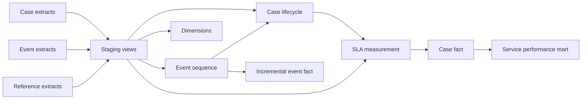

# Analytics Engineering Service Mart

[](https://github.com/quantameridian/analytics-engineering-service-mart/actions/workflows/ci.yml)
[](https://github.com/quantameridian/analytics-engineering-service-mart/actions/workflows/codeql.yml)
[](https://scorecard.dev/viewer/?uri=github.com/quantameridian/analytics-engineering-service-mart)
[](LICENSE)

This dbt project turns service case extracts into a controlled reporting mart.
It answers a practical management question: for each monthly intake cohort,
which teams and categories carry unresolved work, overdue cases, weak SLA
performance, or slow closure times?

The repository can be run without cloud credentials. Five synthetic extracts are
loaded into DuckDB, transformed through staging and intermediate models, and
published as two dimensions, two facts, and one aggregate mart.

## Read The Result First

The fastest route through the work is:

1. Open the generated [mart preview](docs/mart-output-preview.md).
2. Read the [metric definitions](docs/metric-definitions.md), especially the SLA denominator.
3. Inspect the effective target join in [int_service_sla_status.sql](models/intermediate/int_service_sla_status.sql).
4. Inspect the enforced schemas and tests in [models/marts/schema.yml](models/marts/schema.yml).
5. Open the generated [build evidence](docs/build-evidence.md).

The reporting period is the month in which a case opened. Counts describe the
state of that intake cohort at the configured report date, `2026-06-19`. This is
not a period end backlog snapshot and it does not claim that closures happened in
the opening month.

## Business Rules

Service records often arrive as separate case, event, team, category, and target
extracts. Repeating joins and KPI logic in a dashboard makes the result difficult
to test. This project keeps that logic in dbt and publishes fields that a report
can consume directly.

The SLA calculation makes four states visible:

| State | Meaning | Included in SLA rate |
| --- | --- | --- |
| `measured` | Category is eligible, a due time exists, and an effective target matched | Yes, when closed |
| `not_eligible` | Category is outside SLA scope | No |
| `missing_due_date` | Category is eligible but the case has no due time | No |
| `missing_target` | Category is eligible but no target applied on the open date | No |

This prevents missing data from being silently treated as good or bad SLA
performance. The mart publishes both the exclusions and the measured denominator.

Targets match on category, priority, and case open date. Overlapping target
periods fail a data test. The report date is a dbt variable shared by age and
overdue calculations, which keeps local and CI results reproducible.

## Model Route


```mermaid
flowchart LR
    A["Case extracts"] --> B["Staging views"]
    C["Event extracts"] --> B
    D["Reference extracts"] --> B
    B --> E["Event sequence"]
    B --> F["Case lifecycle"]
    E --> F
    F --> G["SLA measurement"]
    B --> G
    G --> H["Case fact"]
    E --> I["Incremental event fact"]
    B --> J["Dimensions"]
    H --> K["Service performance mart"]
```

| Published model | Grain | Materialization | Main use |
| --- | --- | --- | --- |
| `dim_team` | One row per team | Table | Ownership and service area labels |
| `dim_service_category` | One row per category | Table | Category and service group labels |
| `fact_case_performance` | One row per case | Table | Lifecycle, SLA, age, and exception evidence |
| `fact_service_event` | One row per event | Incremental | Ordered audit trail with a seven day lookback |
| `mart_service_performance` | One row per opening month, report date, team, and category | Table | Cohort workload and service performance |

Every published model has an enforced dbt contract. The event fact uses an
incremental merge by `event_id`; the quality gate reruns it and compares row count
and content hash to prove that unchanged input is idempotent.

## Quality Gate

Create a Python 3.11 or newer environment, then run:

```bash
make install
make audit
make qa
```

`make qa` performs a clean build. It validates source headers and row counts,
lints the Python support scripts, builds every seed and model, runs unit and data
tests, generates the dbt catalog, refreshes the mart preview, writes stable build
evidence, and verifies the incremental fact.

The same gate runs in GitHub Actions. CI uploads the dbt manifest, catalog, run
results, mart preview, and build evidence for seven days. Generated databases,
compiled SQL, logs, caches, and credentials remain ignored by Git.

Individual commands remain available for investigation:

```bash
make seed
make run
make test
make docs
make preview
make verify-incremental
```

## Repository Map

| Path | What it contains |
| --- | --- |
| `seeds/` | Synthetic case, event, team, category, and target inputs |
| `models/staging/` | Type handling and source normalization |
| `models/intermediate/` | Event order, lifecycle, SLA eligibility, and target matching |
| `models/marts/` | Contracted dimensions, facts, and aggregate mart |
| `tests/` | Reconciliation, grain, date, target, rate, and business rule assertions |
| `contracts/` | Source shape, reporting context, model, and quality gate agreement |
| `scripts/` | Contract validation, preview export, build evidence, and idempotency check |
| `docs/` | Metric, lineage, operating, security, and decision records |

## Engineering Decisions

The project uses DuckDB because the complete route can be reviewed locally. SQL
is kept close to ANSI patterns, while date functions and the incremental strategy
remain adapter specific. A warehouse migration would need adapter testing,
credential management, source freshness rules, deployment controls, and volume
testing.

The current input contains 30 cases and 61 events. It is large enough to exercise
closed, open, paused, reopened, cancelled, overdue, eligible, and excluded paths.
It is not evidence of scale or warehouse performance.

Detailed rationale and tradeoffs are recorded in:

- [modelling decisions](docs/modelling-decisions.md)
- [data lineage](docs/data-lineage.md)
- [orchestration and freshness](docs/orchestration-and-freshness.md)
- [test plan](docs/test-plan.md)
- [security posture](docs/security-posture.md)
- [limitations](docs/limitations.md)

The implementation follows dbt guidance on [model contracts](https://docs.getdbt.com/docs/mesh/govern/model-contracts), [unit tests](https://docs.getdbt.com/docs/build/unit-tests), and [incremental models](https://docs.getdbt.com/docs/build/incremental-models).

## Data Boundary

All names and records are synthetic. The local profile writes only to
`target/service_mart.duckdb`. Do not add production credentials, private
extracts, customer records, employer data, or generated dbt artifacts.
