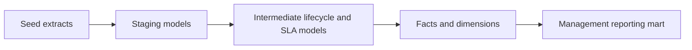

# Analytics Engineering Service Mart

[](https://github.com/quantameridian/analytics-engineering-service-mart/actions/workflows/ci.yml)
[](https://github.com/quantameridian/analytics-engineering-service-mart/actions/workflows/codeql.yml)
[](https://scorecard.dev/viewer/?uri=github.com/quantameridian/analytics-engineering-service-mart)
[](LICENSE)

## Project purpose

This repository is a public portfolio example of analytics engineering with dbt. It turns service and operations extracts into tested reporting models.

It uses synthetic seed data, SQL models, dbt tests, and clear notes to show how raw service records can become a service performance mart that someone else can inspect and run.

## Portfolio focus

This repo is designed to show the work behind a reliable dashboard: source modelling, staging logic, dimensional design, metric definitions, tests, lineage, and a mart preview that is generated from the project rather than typed by hand.

A hiring or technical reviewer should be able to follow the model route without needing private data or cloud credentials. Raw service records move through staging, intermediate logic, facts, dimensions, and a final mart. Along the way, the repo shows model grain, metric definitions, dbt tests, exposures, and a generated preview from DuckDB.

What this does not claim: this is not a deployed warehouse project. There is no cloud warehouse target, production scheduler, live freshness feed, or BI dashboard yet. The value is in the modelling, testing, contract, and review path.

## Reviewer quick path

If you only have a few minutes, start here:

1. Read [docs/reviewer-guide.md](docs/reviewer-guide.md).
2. Read the source to mart route and facts and dimensions below.
3. Inspect `contracts/service-mart-contract.json` for the source, mart, exposure, and quality gate contract.
4. Inspect `docs/mart-output-preview.md` to see a generated sample of the final mart.
5. Read [docs/orchestration-and-freshness.md](docs/orchestration-and-freshness.md) for the scheduler and freshness path.
6. Run `make qa` to validate the contract, seed, run, test, generate dbt docs, and refresh the mart preview.

The current GitHub Actions workflow runs dbt seed, run, test, docs generation, and preview export on every push to `main`.

## Business problem

Service and operations reporting often starts with disconnected exports: case lists, team files, service events, status changes, categories, targets, and SLA extracts. The report becomes hard to trust when the logic is hidden in spreadsheets or repeated by hand.

The scenario is a service function that cannot reliably answer basic management questions:

- how many cases are open;
- how many cases are overdue;
- how long cases take to close;
- which teams are under pressure;
- whether SLA performance is improving;
- which categories create the highest workload.

This project shows how those questions can be answered through a clear model route rather than repeated spreadsheet work.

## What this project shows

- SQL transformation from raw extracts to models that are ready for reporting.
- dbt project structure with staging, intermediate, and mart layers.
- Dimensional modelling for service performance reporting.
- Defined model grain and metric logic.
- Data tests for keys, relationships, accepted values, and metric assumptions.
- Lineage from source extracts to management outputs.
- Documentation that separates business questions from implementation detail.

## Skills demonstrated

| Skill | Where to inspect |
| --- | --- |
| dbt project structure | `models/staging`, `models/intermediate`, and `models/marts` |
| Dimensional modelling | `dim_team`, `dim_service_category`, `fact_case_performance`, `fact_service_event`, and `mart_service_performance` |
| Data testing | `models/**/schema.yml` and `tests/generic` / `tests/assertions` |
| Data contract discipline | `contracts/service-mart-contract.json` and `scripts/validate_service_mart_contract.py` |
| Downstream lineage | `models/exposures.yml` and generated dbt docs |
| Metric definition | [docs/metric-definitions.md](docs/metric-definitions.md) and [models/marts/schema.yml](models/marts/schema.yml) |
| Orchestration readiness | [docs/orchestration-and-freshness.md](docs/orchestration-and-freshness.md) |
| Review output | [docs/mart-output-preview.md](docs/mart-output-preview.md) generated from DuckDB after dbt run |
| Public repo security practice | [docs/security-posture.md](docs/security-posture.md), CI, CodeQL, Scorecard, and dependency audit |

## Architecture

Implemented dbt route:


```mermaid
flowchart LR
    A["Seed extracts"] --> B["Staging models"]
    B --> C["Intermediate lifecycle and SLA models"]
    C --> D["Facts and dimensions"]
    D --> E["Management reporting mart"]
```

The project keeps transformation logic in dbt rather than in a reporting tool. Staging models clean the seed extracts, intermediate models calculate case lifecycle and SLA state, and mart models expose dimensions, facts, and a management aggregate.

## Source tables

The project uses synthetic dbt seed files:

| Source seed | Purpose | Grain |
| --- | --- | --- |
| `raw_cases.csv` | One row per service case or operational request | Case |
| `raw_teams.csv` | Team reference data and reporting ownership | Team |
| `raw_service_events.csv` | Event history for assignment, status change, review, pause, and closure | Case event |
| `raw_case_categories.csv` | Case category and service grouping reference | Category |
| `raw_targets.csv` | SLA target thresholds by category and priority | Category/priority target |

## Facts and dimensions

| Model | Type | Grain | Purpose |
| --- | --- | --- | --- |
| `dim_team` | Dimension | One row per team | Team ownership, reporting unit, active flag |
| `dim_service_category` | Dimension | One row per category | Category grouping and reporting labels |
| `fact_case_performance` | Fact | One row per case | Case lifecycle, status, owner, SLA, overdue and cycle time fields |
| `fact_service_event` | Fact | One row per case event | Event detail for lifecycle review |
| `mart_service_performance` | Mart | One row per reporting period, team, and category | Service metrics for management review |

## Model grain

The main fact table uses one row per case. Event history remains separate so lifecycle calculations are traceable. The management mart aggregates to reporting period, team, and category.

## Sample data

All sample data is synthetic. It represents generic service activity only, such as cases, teams, service events, dates, statuses, categories, and simple SLA indicators.

See [docs/data-dictionary.md](docs/data-dictionary.md) for field definitions, row counts, assumptions, and known data imperfections.

## How to run locally

Install the local dbt environment:
Use Python 3.11 or newer; the CI security checks run on Python 3.11.

```bash
make install
```

Then load seeds, build the models, and run tests:

```bash
make qa
```

Or run the dbt commands directly with the local profile:

```bash
dbt seed --profiles-dir .
dbt run --profiles-dir .
dbt test --profiles-dir .
```

The project uses DuckDB locally and writes the development database to `target/service_mart.duckdb`.

## Outputs

Current outputs:

- staged service data with cleaned column names and types;
- intermediate case lifecycle, service event sequence, and SLA status models;
- dimensional models for teams and categories;
- fact table for case performance;
- service performance mart for management review;
- generated mart preview in `docs/mart-output-preview.md`;

Local generated outputs:

- dbt docs artifacts in `target/`;
- DuckDB development database in `target/service_mart.duckdb`.

## Tests and quality checks

Current checks:

- source contract validation for seed headers, row counts, published marts, and dbt exposures;
- not null and unique tests on source and model keys;
- accepted values for statuses, priorities, event types, and active flags;
- relationship tests between cases, teams, categories, events, and SLA targets;
- business rule tests for non negative cycle time, overdue classification, and SLA flag consistency;
- metric tests for overdue, SLA, backlog, and cycle time calculations.
- mart column descriptions are included for generated dbt docs review.
- Python/dbt dependencies are audited with `make audit`.
- GitHub Actions CI installs the local dbt/DuckDB environment and runs `dbt seed`, `dbt run`, `dbt test`, `dbt docs generate`, and the mart preview export.

Security posture, warehouse credential boundaries, and public data rules are documented in [docs/security-posture.md](docs/security-posture.md).

## Acceptance criteria

The current public review criteria are:

- source seeds are synthetic and documented;
- staging models preserve source meaning while cleaning names and types;
- intermediate models make lifecycle and SLA logic explicit;
- fact and dimension grains are documented;
- dbt tests pass locally;
- the mart can answer the reporting questions listed in this README;
- limitations are clear and do not imply real client delivery.

## Where this fits

This repo shows the work that should sit behind a reliable dashboard: source to output modelling, documented metrics, tested transformations, and SQL that another person can follow.

It is deliberately separate from the Python data quality engine repo. This project focuses on SQL modelling and reporting mart design; it does not generate exception registers or score source data quality.

For portfolio review, this repo is strongest as evidence of dbt modelling, SQL transformation design, data tests, metric definition, and downstream lineage.

## Limitations

- Synthetic data only.
- Local dbt project rather than a cloud warehouse deployment.
- Metrics will be illustrative and should not be treated as industry benchmarks.
- Current dbt models cover staging, intermediate logic, dimensions, facts, and the service performance mart.
- CI uses DuckDB locally and does not test deployment to a cloud warehouse or BI tool.

## Next improvements

1. Add more seed rows so the mart supports richer trend and category comparisons.
2. Add SQL linting if the project grows beyond the current compact model set.
3. Add a dbt docs screenshot only after it is generated from the actual project.
