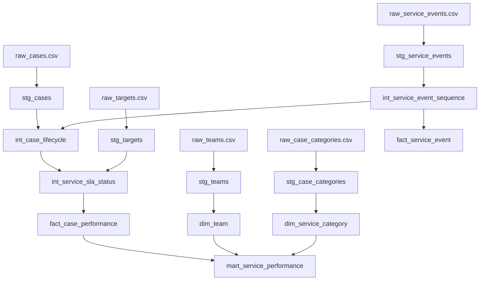

# Data Lineage

## Purpose

This document defines the source-to-mart lineage for the service performance analytics engineering project. The staging, intermediate, and mart layers are implemented.

## Source extracts

| Source | Description | Grain |
| --- | --- | --- |
| `raw_cases.csv` | Case header extract with opened date, current status, team, category, priority, and closure date | One row per case |
| `raw_teams.csv` | Team reference extract with reporting unit and active flag | One row per team |
| `raw_service_events.csv` | Case event extract with assignment, review, status change, pause, reopen, and closure events | One row per event |
| `raw_case_categories.csv` | Category and service grouping reference | One row per category |
| `raw_targets.csv` | SLA thresholds by category, priority, or service type | One row per SLA target |

## Architecture Diagram

## Layer responsibilities

### Staging

Staging models:

- rename columns into consistent snake case;
- cast dates and booleans;
- keep one model per source extract;
- avoid management reporting calculations.

### Intermediate

Intermediate models:

- reconstruct case lifecycle dates from events where needed;
- calculate SLA eligibility and due dates;
- handle simplified paused, reopened, and cancelled states;
- expose testable business logic before aggregation.

### Marts

Mart models:

- expose dimensions and facts at documented grains;
- support management reporting without repeating transformation logic in dashboards;
- aggregate only after lifecycle and SLA logic has been tested.

## Model Grain Summary

| Layer | Model | Grain | Main downstream use |
| --- | --- | --- | --- |
| Staging | `stg_cases` | One row per case | Case header fields and current status |
| Staging | `stg_teams` | One row per team | Team ownership labels |
| Staging | `stg_service_events` | One row per event | Event history |
| Staging | `stg_case_categories` | One row per category | Category grouping |
| Staging | `stg_targets` | One row per SLA target rule | SLA thresholds |
| Intermediate | `int_service_event_sequence` | One row per event | Ordered lifecycle evidence |
| Intermediate | `int_case_lifecycle` | One row per case | Open, closed, paused, reopened, age, and cycle-time fields |
| Intermediate | `int_service_sla_status` | One row per case | SLA due date, overdue, and reporting status |
| Mart | `dim_team` | One row per team | BI slicer and ownership reference |
| Mart | `dim_service_category` | One row per category | BI slicer and workload grouping |
| Mart | `fact_case_performance` | One row per case | Case-level drill-through and metric traceability |
| Mart | `fact_service_event` | One row per event | Lifecycle audit trail |
| Mart | `mart_service_performance` | One row per reporting period, team, and category | KPI reporting and management summary |

## Reporting questions supported by lineage

- Case volume comes from `fact_case_performance`.
- Open and overdue cases come from lifecycle and SLA fields in `fact_case_performance`.
- Team pressure comes from `dim_team` joined to case backlog and overdue counts.
- SLA performance comes from `int_service_sla_status` and `mart_service_performance`.
- Workload by category comes from `dim_service_category` joined to case facts.

## Traceability Notes

- `fact_case_performance` inherits SLA and overdue logic from `int_service_sla_status`; dashboard tools should not recalculate this logic independently.
- `fact_service_event` uses the sequenced event model rather than raw events so event order is available for review.
- `mart_service_performance` is intentionally aggregated after case-level tests run, so headline metrics can be traced back to individual case rows.
- The sample data is small, so lineage demonstrates model design and testability rather than production-scale performance.
