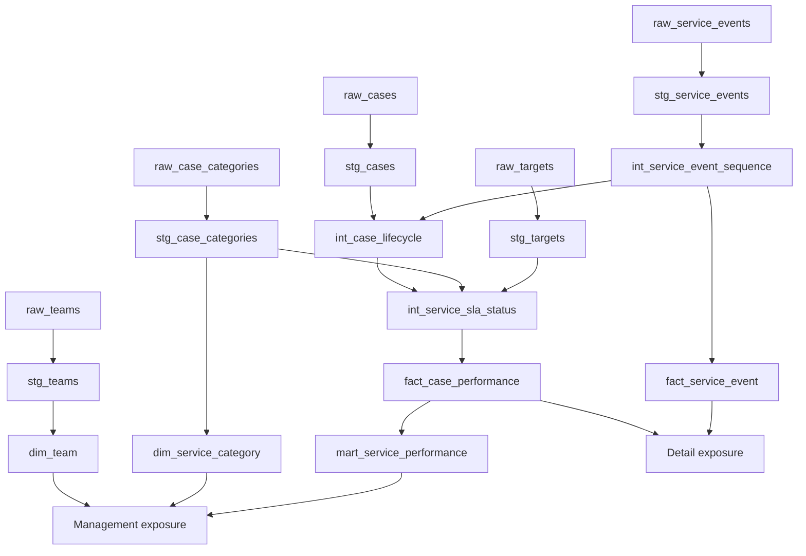

# Data Lineage

The model graph separates source normalization, reusable business logic, and
published reporting relations. Case and event grains remain separate until the
case fact is aggregated.

```mermaid
flowchart TD
    A["raw_cases"] --> B["stg_cases"]
    C["raw_service_events"] --> D["stg_service_events"]
    E["raw_teams"] --> F["stg_teams"]
    G["raw_case_categories"] --> H["stg_case_categories"]
    I["raw_targets"] --> J["stg_targets"]

    D --> K["int_service_event_sequence"]
    B --> L["int_case_lifecycle"]
    K --> L
    L --> M["int_service_sla_status"]
    H --> M
    J --> M

    M --> N["fact_case_performance"]
    K --> O["fact_service_event"]
    F --> P["dim_team"]
    H --> Q["dim_service_category"]
    N --> R["mart_service_performance"]

    P --> S["Management exposure"]
    Q --> S
    R --> S
    N --> T["Detail exposure"]
    O --> T
```

## Grain And Responsibility

| Model | Grain | Responsibility |
| --- | --- | --- |
| `stg_cases` | One row per case | Types, normalized status, month as a date |
| `stg_service_events` | One row per event | Event types and timestamps |
| `stg_teams` | One row per team | Ownership reference and effective dates |
| `stg_case_categories` | One row per category | Service grouping and eligibility |
| `stg_targets` | One row per target period | Priority, thresholds, and effective dates |
| `int_service_event_sequence` | One row per event | Stable order and neighbouring event context |
| `int_case_lifecycle` | One row per case | Lifecycle flags, cycle time, and age at cutoff |
| `int_service_sla_status` | One row per case | Effective target, measurement state, overdue and SLA result |
| `fact_case_performance` | One row per case | Published case evidence for drill through |
| `fact_service_event` | One row per event | Incremental event audit trail |
| `mart_service_performance` | One row per opening month, cutoff, team, and category | Controlled cohort metrics |

The report date enters once through `dbt_project.yml` and is rendered by macros in
`macros/reporting_context.sql`. It flows through lifecycle, case fact, and mart
models so every row states the cutoff used by age and overdue logic.

The target path is also explicit. A case joins to category eligibility and to the
target that was active when the case opened. Failure to match does not remove the
case. It changes `sla_measurement_status`, which keeps the exception visible in
detail and aggregate output.

dbt exposures represent two consumer contracts. The management consumer uses the
aggregate mart and dimensions. The detail consumer uses both facts and dimensions.
Neither consumer is a claim that a live dashboard is deployed.
